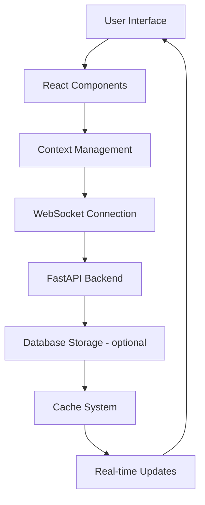

# nsflow 0.6 Updates

## 🎯 **Intro**

Implemented an **Agent Network Designer** that embodies the agentic design philosophy, 
making the neuro-san library accessible to both developers and non-developers alike. 
This comprehensive update transforms nsflow from a simple interactive chat client into a 
well-featured agent orchestration platform with visual design capabilities.

## 🚀 **Key Features in this release**

### **🎨 A visual Agent Network Designer**
- **Real-time Visualization**: Live network updates during design process
- **Context Menu Operations**: Right-click actions (view details)
- **Launch Button**: One-click navigation to Home page with pre-loaded network
- **Intelligent Layout**: Automatic positioning with collision detection

### **📝 Non-Coder Friendly Tools**
- **Visual JSON Editor**: Intuitive interface for managing sly data
- **Import/Export**: File-based sly data management with validation
- **Conflict Resolution**: Smart handling of sly data conflicts with merge options
- **Guided Data Entry**: Step-by-step forms for complex sly data structures

### **💾 Intelligent Caching System**
- **Sly Data Cache**: Persistent storage for agent data across sessions
- **Position Cache**: Smart layout management for agent networks
- **Session Persistence**: Automatic state restoration across user sessions

### **🎨 MUI Theming System**
- **Light/Dark Mode**: Automatic theme switching with persistence
- **Custom Properties**: Extended theme support for specialized components
- **Performance**: Optimized theme switching without re-renders
- **Consistent Design**: Unified design language across all components

### **Dual-Mode Architecture**
- **Interactive Chat Mode (Home Page)**: Real-time agent conversations with live network visualization
- **Design Mode (Editor Page)**: Visual agent network design and configuration
- **Seamless Navigation**: URL-based network access (`host:port/?network=agent_name`)
- **Launch Button**: One-click navigation between modes with pre-loaded network state

### **Core Components**
- **EditorSidebar**: Session management and agent network selection
- **EditorAgentFlow**: Visual network designer with drag-and-drop functionality
- **EditableAgentNode**: Interactive agent nodes with context menus
- **NetworkAgentEditorPanel**: Detailed agent configuration interface
- **EditorLogsPanel**: Real-time logging and monitoring
- **TabbedChatPanel**: Multi-channel communication interface

### **Sly Data Editor**
- **Visual JSON Editing**: Intuitive interface with syntax highlighting
- **Import/Export**: File-based data management with validation
- **Conflict Resolution**: Smart handling of data conflicts with merge options
- **Real-time Validation**: Instant error detection and highlighting
- **Persistent Caching**: Automatic data persistence across sessions
- **Multi-format Support**: JSON, YAML, and custom format support

## 🏗️ **Technical Implementation**

### **Frontend Architecture**
- **ReactFlow Integration**: Node-based editor with custom components
- **MUI Component System**: Consistent design language with theming
- **Context Management**: Global state management for chat and network data
- **WebSocket Integration**: Real-time updates and monitoring
- **Caching System**: Multi-layer caching with intelligent invalidation

### **Backend Architecture**
- **FastAPI Endpoints**: RESTful API for agent flows and editor state
- **WebSocket Support**: Real-time communication and updates
- **Database Integration**: Persistent storage for sessions and data
- **Validation System**: Comprehensive data validation and error handling
- **Security**: Authentication and authorization for multi-user support

### **Data Flow Architecture**

## 🎨 **Theme Customization**

### **MUI Theme System**
- **Light/Dark Mode**: Automatic theme switching with persistence
- **Custom Properties**: Extended theme support for specialized components
- **Accessibility**: High contrast ratios and accessible color schemes
- **Performance**: Optimized theme switching without re-renders

### **Customization Options**
- **Color Schemes**: Custom color palettes for different use cases
- **Typography**: Configurable font families and sizes
- **Spacing**: Consistent spacing system across components
- **Components**: Custom component styling and behavior

## 📁 **Key File Changes in this version**

### **Frontend Components**
- `nsflow/frontend/src/components/EditorAgentFlow.tsx` - Main network designer react-flow view port
- `nsflow/frontend/src/components/EditorSidebar.tsx` - Session management
- `nsflow/frontend/src/components/NetworkAgentEditorPanel.tsx` - Agent configuration
- `nsflow/frontend/src/context/ChatContext.tsx` - Global state management
- `nsflow/frontend/src/hooks/useSlyDataCache.ts` - Sly Data Caching system

### **Backend API**
- `nsflow/backend/api/v1/agent_flows.py` - Agent flow management
- `nsflow/backend/api/v1/editor_state.py` - Editor state management
- `nsflow/backend/api/v1/sly_data.py` - Sly data operations
- `nsflow/backend/websocket/manager.py` - WebSocket management

---
